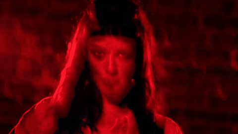

# Virtual Singer Clip Pipeline

End-to-end pipeline for AI music videos with a virtual singer: lyrics → song (ACE-Step) → final audio → video scenes → assembled clip. Supports voice conversion (RVC / Seed-VC), lip-sync (LatentSync, MuseTalk, EchoMimic, Hallo3), and pre-configured style variants.

> **Disclaimer:** only use voices, lyrics, and images you have the right to use. You are responsible for generated content.

## Demo

**Dark rock (virtual singer)** — sample from the `espresso_dark_rock` variant:



▶ [Watch full demo clip (30s, 720p)](docs/demo/espresso_dark_rock.mp4)

Dark rock-pop style, hybrid lip-sync + scene assembly. Synthetic virtual character — not a real person or artist.

## What the pipeline does

1. Generate or load lyrics (`assets/lyrics/`)
2. Generate sung music with ACE-Step
3. Split stems (Demucs) and finalize audio
4. (Optional) Convert voice with RVC or Seed-VC
5. Generate scene prompts and video clips
6. (Optional) Lip-sync / talking-head avatar
7. Assemble the final music video

Default output: `output/` or `output/variants/<name>/`.

## Requirements

- Python 3.10+
- NVIDIA GPU (recommended)
- Git
- Hugging Face token (`HF_TOKEN`) for gated models — export before running:

```bash
export HF_TOKEN=hf_...
```

## Setup

```bash
git clone https://github.com/davidoneilai/virtual-singer-clip.git
cd virtual-singer-clip

python -m venv .venv
source .venv/bin/activate
pip install -U pip
pip install -r requirements.txt
bash setup_external.sh
```

Install dependencies for the backends you plan to use:

```bash
# Music generation (ACE-Step)
pip install -r requirements-acestep.txt

# Voice conversion
pip install -r requirements-seedvc.txt    # Seed-VC
pip install -r requirements-rvc.txt         # RVC (see scripts/setup_rvc.sh)

# Lip-sync / avatar (pick one or more)
bash scripts/setup_latentsync.sh
bash scripts/setup_musetalk.sh
bash scripts/setup_echomimic.sh
bash scripts/setup_hallo3.sh
```

`01_generate_song_acestep.py` uses the `pt` backend by default (no flash-attn). For `vllm`:

```bash
pip install -e external/ACE-Step-1.5/acestep/third_parts/nano-vllm
python scripts/01_generate_song_acestep.py --backend vllm
```

## Local assets

Files under `assets/` are **not committed** to the repo. See [assets/README.md](assets/README.md).

| Folder | Contents |
|--------|----------|
| `assets/lyrics/` | Input lyrics (`.txt`) |
| `assets/references/<tag>/` | Vocal reference clips (`.wav`) for conversion |
| `assets/voices/<tag>/` | Trained RVC model (`model.pth`, `model.index`) |
| `assets/avatars/<tag>/` | `avatar.png` / `avatar.mp4` for lip-sync |

## Cache and downloads

Hugging Face / torch caches default to `.cache/` inside the project (not `~/.cache`):

```bash
export VSC_CACHE_DIR=./.cache   # optional; this is the default
```

ACE-Step checkpoints: `external/ACE-Step-1.5/checkpoints/` (after first run).

## Run the basic pipeline

Add your lyrics under `assets/lyrics/`, set env vars if needed, then:

```bash
python scripts/00_generate_lyrics.py
python scripts/01_generate_song_acestep.py
python scripts/02_split_stems_demucs.py
python scripts/04_finalize_audio.py --mode song
python scripts/05_make_scene_prompts.py
python scripts/06_generate_video_wan.py
python scripts/08_assemble_clip.py
```

Or run everything at once (no lip-sync):

```bash
python run_all.py
```

## Variants

High-level scripts in `scripts/run_*.sh` configure musical style, avatar, and prompts. Examples:

```bash
bash scripts/run_pipeline.sh sabrina_sao_joao_quadrilha
bash scripts/run_pipeline.sh anderson_modao_goiano
bash scripts/run_pipeline.sh espresso_blues_jazz
```

Output: `output/variants/<variant>/final_videoclip.mp4`.

Useful environment variables:

| Variable | Description |
|----------|-------------|
| `VSC_CLIP_MODE` | `hybrid` (default) or another assembly mode |
| `VSC_VOICE_CONVERSION` | `1` to enable RVC |
| `VSC_VIDEO_ONLY` | `1` to skip audio and only render video |
| `VSC_CACHE_DIR` | HF/torch cache directory |

## Optional lip-sync

Place an avatar at `assets/avatar.mp4` (or `assets/avatars/<tag>/`) and run your backend:

```bash
python scripts/07_lipsync_latentsync.py
python scripts/07_lipsync_musetalk.py
python scripts/07_avatar_echomimic.py
python scripts/07_avatar_hallo3.py
```

## Docker

Mount the project at `/workspace` inside the container:

```bash
docker run --rm -it --gpus all \
  -e HF_TOKEN="$HF_TOKEN" \
  -w /workspace \
  -v "$(pwd)":/workspace \
  your-gpu-image bash
```

Background pipeline (logs to `output/pipeline.log`):

```bash
docker rm -f vsc-pipeline 2>/dev/null || true

docker run -d --name vsc-pipeline \
  --gpus device=0 \
  -e HF_TOKEN="$HF_TOKEN" \
  -w /workspace \
  -v "$(pwd)":/workspace \
  your-gpu-image \
  bash scripts/docker_pipeline.sh

tail -f output/pipeline.log
```

Pass specific scripts as arguments to `docker_pipeline.sh`.

## Repository layout

```
virtual-singer-clip/
├── scripts/           # Pipeline and setup
├── docs/demo/         # Sample output for README
├── assets/            # Local inputs (not versioned)
├── external/          # Repos cloned by setup_external.sh
├── output/            # Generated outputs
├── .cache/            # HF/torch cache
├── run_all.py         # Basic end-to-end pipeline
└── setup_external.sh  # Clones ACE-Step, MuseTalk, LatentSync, etc.
```

## License

MIT — see [LICENSE](LICENSE).
